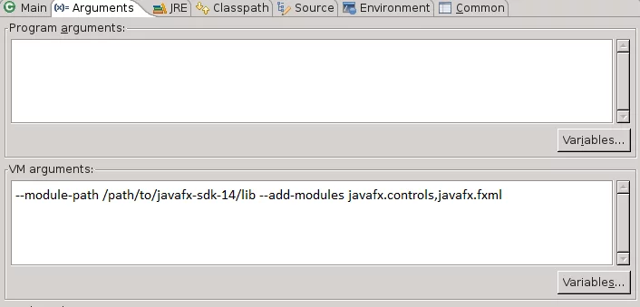

# Esqueleto Gradle - JavaFX

## Config. Previa

Antes de empezar modifica el par&aacute;metro `prefixUsername` y ponle como valor tu inicial seguida de tu apellido, ejemplo `eserrano` para Eduardo Serrano.

Una vez realizado el cambio guarda el archivo, si lo necesitas refresca la configuraci&oacute;de Gradle en Eclipse. 
Bot&oacute;n derecho sobre el proyecto > Gradle > Refresh Gradle Project.

[Web Oficial Java FX](https://openjfx.io/)

## Configuraci&oacute;n de Eclipse
Para poder arrancar como proyecto Java en Eclipse o hacer Debug, es necesario

1. Instalar en Eclipse el plugin para Java FX e(fx)clipse desde el marketPlace

[Installation Instructions](https://www.eclipse.org/efxclipse/install.html)

2. Descargar el SDK de JavaFX 11 LTS

[Java FX Linux SDK - v11.0.9](https://gluonhq.com/download/javafx-11-0-2-sdk-linux/)
 
[Java FX Windows SDK - v11.0.9](https://gluonhq.com/download/javafx-11-0-2-sdk-windows/)
 
[Web Oficial Descargas](https://gluonhq.com/products/javafx/)

3. Configurar un lanzador de Apliación Java en Eclipse

Run > Run/Debug Configurations..
Especificar p&aacute;rametros de Java VM

`--module-path [JavaFX-SDK-PATH]/lib --add-modules javafx.controls,javafx.fxml`

 
[Fuente](https://edencoding.com/runtime-components-error/#:~:text=Conclusions-,A%20%E2%80%9CRuntime%20Components%20are%20Missing%E2%80%9D%20error%20is%20generated%20by%20the,are%20met%20prior%20to%20launching.)

## Informaci&oacute;n relevante

- [Tests para JFX](https://github.com/TestFX/TestFX/)

- [FXML+SceneBuilder - Hello World Example - Creacion ventanas con XML](https://github.com/gluonhq/scenebuilder/wiki/Basic-JavaFX-project-with-Scene-Builder)

- [JavaFX Documentation Project](https://fxdocs.github.io/docs/html5/#_scene_graph)

- [Tutorial JFX Jenkov](http://tutorials.jenkov.com/javafx/index.html)

- [FXML Introduction](https://openjfx.io/javadoc/15/javafx.fxml/javafx/fxml/doc-files/introduction_to_fxml.html)

- [JavaFX CSS Reference Guide](https://openjfx.io/javadoc/15/javafx.graphics/javafx/scene/doc-files/cssref.html)

- [JavaFX 11 API](https://openjfx.io/javadoc/11/)
